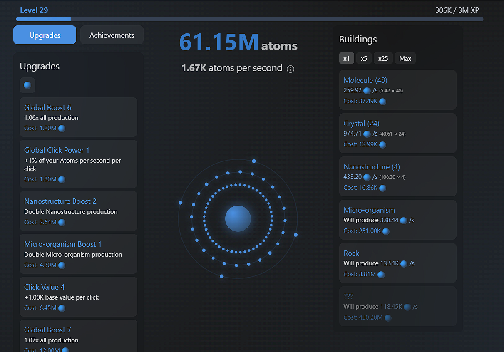

# ⚛️ Atom Clicker

Welcome to Atom Clicker, an engaging incremental game where you'll build your own atomic empire! Start small with individual atoms and work your way up to cosmic structures.

[](https://github.com/Ayfri/Atom-Clicker)
[](https://discord.ayfri.com)
[](https://atom-clicker.ayfri.com)

🎮 [Play Now](https://atom-clicker.ayfri.com) | 💬 [Discord](https://discord.ayfri.com)



## 🎮 How to Play

1. **Click the Atom:** Start by clicking the central atom to generate your first atoms.
2. **Buy Buildings:** Use your atoms to purchase buildings that automatically generate more atoms for you.
3. **Upgrade:** Enhance your buildings and clicking power through the upgrades menu.
4. **Unlock Skills:** Spend your earned points in the Skill Tree to gain massive permanent boosts.
5. **Reset for Power:** When progress slows down, perform a reset to gain powerful currencies like Protons and Electrons to further boost your empire.

## ⚛️ Features

### Core Mechanics
- 🖱️ Click to generate atoms
- 🏗️ Build and manage various structures:
  - From tiny molecules to massive cosmic entities
  - Each structure with unique production rates
  - Level up your buildings to increase their efficiency

### Progression Systems
- 🌳 Extensive Skill Tree
  - Unlock powerful multipliers
  - Enhance your clicking power
  - Boost your production capabilities
  - Unlock automation features

- 🎮 Multiple Reset Layers
  - Each layer provides powerful bonuses
  - Strategic decisions on when to reset
  - Permanent progression rewards

### Advanced Features
- ⚡ Power-up System
  - Random power-ups appear during gameplay
  - Stack multiple effects
  - Upgrade their duration and effectiveness

- 🤖 Automation
  - Auto-buy buildings
  - Auto-upgrade systems
  - Optimize your production

- 🟣 Purple Realm
  - Unlock a mysterious gameplay dimension with interactive violet circles

### Social Features
- 📊 Global Leaderboard
- 🏆 Achievement System
- 🔒 Secure Authentication

## 🚀 Getting Started

1. Install dependencies:
```bash
pnpm install
```

2. Start the development server:
```bash
pnpm dev
```

3. Build for production:
```bash
pnpm build
```

## 🛠️ Built With

- **Framework:** [SvelteKit](https://kit.svelte.dev/)
- **Language:** [TypeScript](https://www.typescriptlang.org/)
- **Styling:** [TailwindCSS](https://tailwindcss.com/)
- **Graphics Engine:** [Pixi.js](https://pixijs.com/)
- **Backend & Auth:** [Supabase](https://supabase.com/)
- **Icons:** [Lucide Icons](https://lucide.dev)
- **Flow Diagrams:** [Svelte Flow](https://svelteflow.dev)

## 🌐 Deployment

This project is optimized for [Cloudflare Workers](https://workers.cloudflare.com/).

```bash
# Build for production
pnpm build
```

The build output will be in the `.svelte-kit/cloudflare` directory, ready to be deployed.

## 📝 License
This project is open source and available under the [GNU GPLv3 License](LICENSE).

## 🤝 Contributing
Contributions, issues, and feature requests are welcome! Feel free to check the [issues page](https://github.com/Ayfri/Atom-Clicker/issues).
